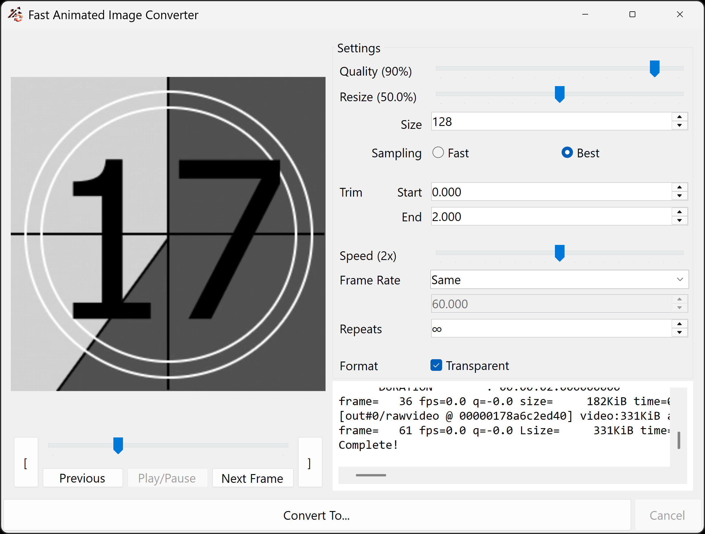
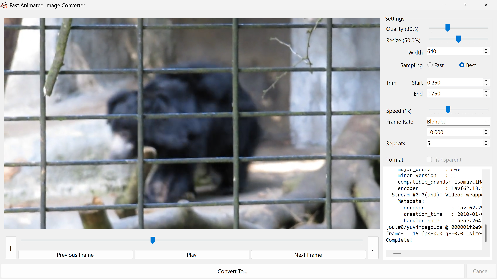
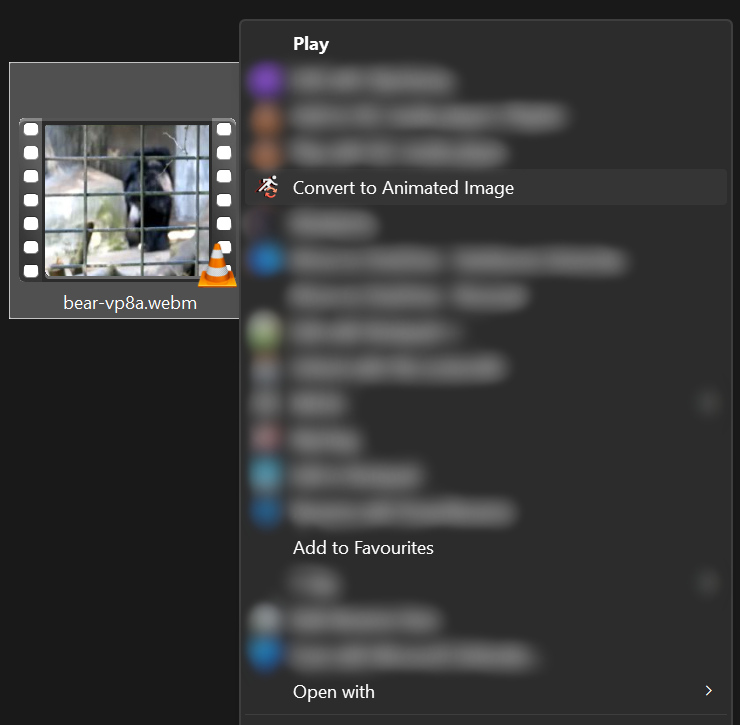

<h1 align="center">
      &nbsp;&nbsp; Fast Animated Image Converter
</h1>

A simple GUI layer on top of existing softwares to take the guesswork out of creating animated images.

    
    

I made this mostly because I was finding those online conversion tools had unbearably slow upload speeds, ffmpeg CLI was really tough to work with, and the common prebuilt ffmpeg binaries didn't even ship with the right features to create certain types of animated formats in the first place.

The aim of the project was to produce a clutter-free simple interface for converting files to animated images, and add it to the file explorer context menu to make it as easy as possible.

    

GIF support is also achieved via [gifski](https://gif.ski/), a higher-quality GIF encoder than ffmpeg's built-in one.

## Output Support

> [!WARNING]
> JPEG XL does not currently support finite loops, due to limitations with ffmpeg. By default, JPEG XL files will loop infinitely. Otherwise, all formats can have finite loop counts, or loop infinitely.

Fast Animated Image Converter supports creating:

- GIF
- WebP
- APNG
- JPEG XL
- AVIF

Transparency is supported for all formats.

## Input Support
| Codec | Input | Transparent Input |
| :--- | :---: | :---: |
| AVI | Yes | No |
| H.264 | Yes | No |
| H.265 | Yes | No |
| VP8 | Yes | Yes |
| VP9 | Yes | Yes |
| AV1 | Yes | No |

Most container formats (mp4, mov, mkv, webm, etc.) for these codecs should work, it comes down mostly to what ffmpeg supports.
Preview support for any given format depends on your computer.
Other input codecs may work, but support cannot be garuanteed, and you likely won't be able to preview it in the left panel.

## Installation
Download the installer from the releases tab, and run the installer! This program will only run on 64-bit Windows machines. If it doesn't work after installation, ensure that the [.NET Desktop Runtime 8.0](https://dotnet.microsoft.com/en-us/download/dotnet/8.0) (make sure you download the right thing from this page) is installed on your machine.

## Build
This isn't rigorously tested, but if you clone the repo and run build.ps1 in powershell, it should build the program using the included publishing profile. You'll need to have all the relevant libraries installed on your machine first, though. You will need to install Inno Setup 6 on your machine for the installer to build properly after that.

# About
To get more information about the program, right click on the icon in the top left and select "About", or press Control+F1. This will give further information about the program, the external binaries included, and the licenses involved.